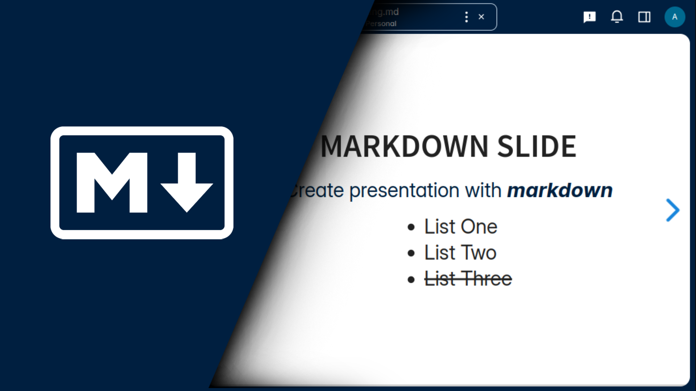

# Markdown Presentation Viewer for ownCloud Web



A markdown presentation viewer for [ownCloud web](https://github.com/owncloud/web/) (the webUI of [oCIS](https://github.com/owncloud/ocis/)) using the [reveal.js](https://revealjs.com/) library.

It allows users to:

- create slide presentations directly from markdown files
- share the slides using public links

## Demonstration

- [Demonstation page](https://ocis.in-nepal.de/files/link/public/bdSEsErbfGKoOIt?fileId=bdSEsErbfGKoOIt&files-public-link-view-mode=resource-table)
- Click on `Open in Presentation Viewer` to view the slides

## Supported oCIS and Web Versions

- [oCIS](https://github.com/owncloud/ocis) (>= 6.x.x)
- [Web](https://nodejs.org/en/) (>= 9.x.x)

## App Installation

> NOTE: Requires oCIS >= 6.0.0

1. Download the zip file from the [releases page](https://github.com/JankariTech/web-app-presentation-viewer/releases)

   For example: `mdpresentation-viewer-x.x.x.zip`

2. Extract the zip file to the `apps` directory of the oCIS server.

   Apps directory is set using the `WEB_ASSET_APPS_PATH` environment variable.

## Creating Presentation

Please, refer to the [documentation](https://revealjs.com/markdown/) for more information about creating a presentation using markdown.

This app has the following default slide separators:

- Horizontal separator: `---` (`← →`)
- Vertical separator: `--` (`↓ ↑`)

## Development

#### Prerequisites

- [Node.js `v18`](https://nodejs.org/en/)
- [pnpm `v8`](https://pnpm.io/)
- [Docker Compose](https://docs.docker.com/compose/)

#### 1. Install dependencies:

```bash
pnpm install
```

#### 2. Build the extension

For development, build with watch.

```bash
pnpm build:w
```

#### 3. Load the extension

> NOTE: Requires oCIS >= 6.0.0

Run the oCIS server:

```bash
docker compose up
```

oCIS URL: [localhost:9200](https://localhost:9200)
