# Presentation Viewer
---
## Table of Contents
1. Introduction
   - OpenCloud
   - oCIS
   - Presentation Viewer
2. Usages 
3. Why this App?
4. How to use the extension? 
5. Writing markdown? 
6. Example of Markdown File
---
## Introduction
--
### OpenCloud

[Self-Hosted File Sharing](https://github.com/opencloud-eu/opencloud/)

Secure, Simple and Reliable
--
### ownCloud Infinite Scale (oCIS)
[ownCloud Infinite Scale (oCIS)](https://github.com/owncloud/ocis) is the new file sync & share platform that will be the foundation of your data management platform.
--
### Presentation Viewer
Extension for OpenCloud & oCIS
---
## Usages
Allows users to create slide presentations directly from markdown files
---
## Why this App?
- To reduce your time for formatting
- You will get more time on content
- Uniform design for organization presentations
---
## How to use the extension?
- Right-click on the resource
- Click _Open in Presentation Viewer_
---
## Writing markdown?
We are using Triple Dash "---" as a slide separator
---
## Example of Markdown File

 ```
 # Title for slide 1
 Content of slide 1
 ---
 # Title for slide 2
 Content of slide 2
 ---
 # Title for slide 3
 Content of slide 3
 ```
---
### Flowcharts with Mermaid

```mermaid
flowchart LR
  A[Boss tells <br>you to create <br>a presentation] --> B{Use Powerpoint or a MD file?};
  B -- Powerpoint --> C(Frustration 😫);
C --> D[Rethink 🤔];
D --> B;
B -- MD file 🧑‍💻 ----> E[Job done 👍];
```


